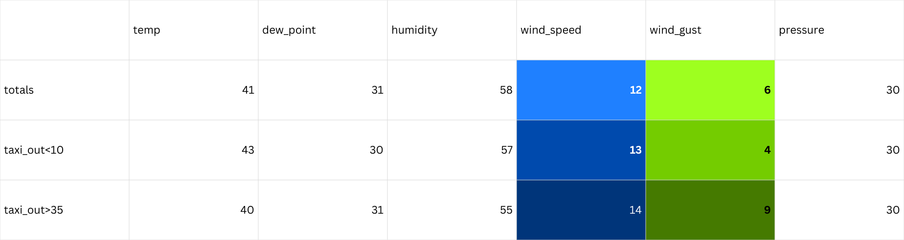

# JFK Data Analysis - Phase 1 (short)

## Analysis Overview

This document briefly introduces the initial phase of work on the [JFK Airport dataset](https://www.kaggle.com/datasets/deepankurk/flight-take-off-data-jfk-airport/data). The main question guiding this work is: 

**What factors most strongly affect taxi‑out times, and how?**

This section covers basic transformations, exploratory findings, and clarifications from the first follow‑up meeting, including handling outliers, missing values, wrong labels, address issues.  All analyses and transformations in this stage were performed in **SQL**.

## Data Transformation

The original dataset contained **23 columns**, many of which were not ideal for direct analysis. After transformation, the **airport_data** became:

1. **id** – added as a unique identifier for programming safety
2. **timestamp** – (MONTH, DAY_OF_MONTH,crs_dep_m)
3. **carrier** – (OP_UNIQUE_CARRIER)
4. **flight_code** – (TAIL_NUM)
5. **destination** – (DEST)
6. **dep_delay** – (dep_delay)
7. **distance** – (DISTANCE)
8. **departures** – (sch_arr)
9. **arrivals** – (sch_dep)
10. **taxi_out** – (TAXI_OUT)
11. **taxi_10tile** (10 tiled taxi_out variable for easier **Power BI** later use)

The database also included pre‑taxi‑out details such as scheduled vs. actual departure and arrival times. These were confirmed not to be relevant for analysis at this stage. However, I included **dep_delay** for internal review only.

A separate section was created for **weather_data**:

1. **id**
2. **timestamp** – (MONTH, DAY_OF_MONTH,crs_dep_m)
3. **temperature** (Temperature)
4. **dew_point** (Dew Point)
5. **humidity** (Humidity)
6. **wind** (Wind)
7. **wind_speed** (Wind Speed)
8. **wind_gust** (Wind Gust)
9. **pressure** (Pressure)
10. **condition** (Condition)
11. **taxi_out** (TAXI_OUT)
12. **taxi_10tile** 

## Findings

This section highlights only a selection of the findings from each variable group. The full exploratory work including every graph, summary table, and distribution check is documented separately, and can be viewed in the file [**images**](images).  In addition, the [**SQL_scripts**](SQL_scripts) folder contains representative queries used during data cleaning and transformation.

### Weather Variables

Most weather measures appeared to be irrelevant. For example, average temperature was about 3 degrees lower in flights with better taxi‑out performance (<10 minutes) compared to worse ones (>35 minutes). 
The only partial exception was **wind**: higher wind speed and gusts were associated with slightly worse **taxi‑out** times:

### Day of Week

Day of the week showed a stronger effect. However, the pattern requires further analysis:

- **Friday**:  ~19% of flights had taxi‑out >38 minutes, while ~12.5% were <18 minutes.
- **Tuesday**:  ~9% of flights >38 minutes, versus ~15.5% <18 minutes.

### Distance

Flight distance also mattered :

| **Distance** | **AVG.Taxi‑Out(min)** |
| --- | --- |
| 1162.17 | 12.6 |
| 1222.44 | 14.99 |
| 1267.75 | 20.86 |
| 1365.05 | 39.44 |
| 1406.99 | 39.95 |

### Carrier

Carrier differences were dramatic:

- AS: ~15% of flights >33 minutes taxi‑out, only ~3% <15 minutes.
- B6: ~4% >33 minutes, but ~22% <15 minutes.

## Outliers control

| Variable | Lower outlier | Upper outlier |
| --- | --- | --- |
| taxi_out | 5 | 41 |
| distance | 94 | 4983 |
| sch_dep | 0 | 55 |
| sch_arr | 0 | 46 |
| temperature | 17 | 68 |
| dew_point | -3 | 67 |
| humidity | 0 | 97 |
| wind_speed | 0 | 36 |
| wind_gust | 0 | 49 |
| pressure | 29.2 | 30.75 |

Alongside the numeric checks, categorical fields (date, air_carrier, flight_code, destination, condition,wind) were reviewed and found consistent. The only outliers dismissed as false were the two records with **taxi_out** times under 7 minutes, treated as *data errors*. Finally, the two missing values in the **wind** variable were replaced with "CALM", as their corresponding **wind_speed** were 0.

## Follow‑Up Questions and Clarifications

Two data issues were identified and resolved during preprocessing.

First, the **sch_dep** column had been mislabeled in the original documentation. It was described as the number of flights scheduled for arrival, but analysis confirmed it actually represents scheduled departures, while **sch_arr** refers to arrivals. This was verified as a simple documentation error.

Second, the **dew_point** variable contained corrupted entries (for example “**9Ä**” on several dates including Nov 12, Nov 13, Nov 16, Nov 21, and Jan 4). Although algorithmic imputation was initially considered, the dataset was ultimately corrected manually using the clean values provided later.

## Conclusion

Based on prior research, it was expected that **weather** and **airport traffic** would be the strongest predictors of taxi-out performance. However in this stage, further assumptions about the weight of each variable are **not safe to make**.
This phase clarified the dataset’s structure, corrected documentation errors, resolved data-quality issues, and narrowed down which variables deserve deeper modeling attention. With the cleaned data and all clarifications in place, the project now moves into the **second phase**, where proper statistical modeling and scenario testing will begin.
