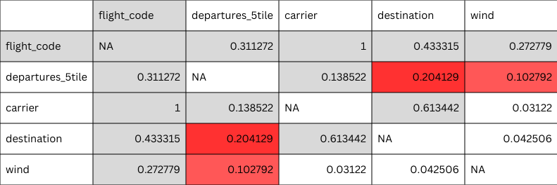

# JFK Data Analysis - Phase 2 Overview

## Analysis Overview

This document provides an overview of the second phase of analysis using the [JFK Airport dataset](https://www.kaggle.com/datasets/deepankurk/flight-take-off-data-jfk-airport/data). The main question guiding this work is: 

**What factors most strongly affect taxi‑out times, and how?**

This section covers correlation checks, ANOVA comparisons, and ranking the most influential variables. It’s the part that directly answers the main project question. The work here used both SQL and R, with most of the analysis carried out in the R environment.

## Methodology Overview

A range of methods were used, including **Pearson**, **Spearman**, **Kendall**, both **ANOVA Type I**  and **Type II** and **Cramér’s V**. To keep the results clean and avoid unnecessary noise, the main conclusions are based on **Pearson** correlations and **ANOVA Type I**,  since **Kendall** and **Spearman** did not show any meaningful differences. After creating the summary table, **ANOVA Type II** was used to re‑evaluate the findings and confirm which effects remained when adjusting for other variables.

## Elimination: Weather **Condition** Variable

The **condition** column from the weather dataset was left out of the analysis. Even though it looks like a normal categorical variable, the labels are inconsistent (for example, the label *fair* appears across **temperatures** from 19° to 61°). Because of this, it doesn’t act as a reliable weather indicator, and using it would add noise rather than useful information.

## Main Results

| Variable    | R²     |
| ----------- | ------ |
| flight_code | 11.14% |
| departures  | 3.62%  |
| carrier     | 3.46%  |
| destination | 2.98%  |
| wind        | 1.23%  |
| time        | 1.13%  |
| wind_gust   | 0.92%  |
| day         | 0.58%  |
| temperature | 0.46%  |
| arrivals    | 0.42%  |
| wind_speed  | 0.39%  |
| distance    | 0.36%  |
| pressure    | 0.35%  |
| hour        | 0.23%  |
| dep_delay   | 0.12%  |
| humidity    | 0.07%  |
| dew_point   | 0.01%  |

## Follow‑Up Insights

### Top Impact Variables

| Variable     | η²(part) |
|--------------|----------|
| flight_code  | 6.98%       |
| departures   | 2.51%       |
| destination  | 1.73%       |
| carrier      | 0.00%       |

Running a Type II ANOVA on the top four impact variables helps check how much shared variance exists between them. Departures and destination behave as expected, keeping almost the same values as in the main results. However, **flight_code** and **carrier** react differently. **Flight_code** drops by about 4 units from its original 11%, which shows that part of its impact overlaps with the other variables and **carrier** is shrunk.

### Flight_code variable

Running the analysis suggests that **flight_code** should not be treated as a standard variable for correlation or effect‑size interpretation. Although it shows some impact, we should not forget that it contains 2,092 different values across 28,818 records, which makes it behave more like an ID. Any relationship it shows is therefore hard to interpret and may reflect structure in the data rather than a real operational effect. Because of this, there is no clear analytical decision on whether **flight_code** should be considered or eliminated. The choice is ultimately up to stakeholders, depending on whether flight‑level detail is viewed as meaningful for their use case. 
A similar behavior is expected from **destination** and **distance** variables.

### Cramér’s V Diagnostic

To further validate the independence of the top‑impact variables, a Cramér’s V analysis was applied across the relevant categorical pairs. As shown in the figure below: 

The only pairs that merit closer examination are **departures ~ destination** and **departures ~ wind**, where a small but non‑negligible signal emerges.

### Secondary Association Check

A set of complementary diagnostics was applied, including Cramér’s V, η² from ANOVA, Kruskal–Wallis, and Mutual Information, to assess whether any residual associations exist between the key variables. Across both pairs, the results point to weak but structurally consistent relationships, with no indication of meaningful shared variance.

* For **departures ~ destination**, the Cramér’s V value (0.204), the moderate η² (≈ 9%), and the strong Kruskal–Wallis signal collectively indicate a small but stable association.

* For **departures ~ wind**, all indicators converge toward a very small effect (Cramér’s V = 0.103, η² ≈ 0.6%, MI ≈ 0.02), and the Kruskal–Wallis result confirms that the relationship is statistically detectable but operationally minimal.

## Summary

This phase focused on determining the actual impact of the most relevant variables and clarifying how much of their signal is unique versus shared. Through effect‑size analysis, partial coverage checks and Type II ANOVA, the predictors with genuine operational relevance were distinguished from those that only appeared influential in earlier stages. This resolved several misleading impressions from [Phase 1](https://github.com/Karyapos/JFK_complete_data_analysis/tree/01-sql-eda) and provided a clearer structural understanding of the dataset. All core code used in this phase is available in the [R_scripts](R_scripts) folder, and selected supporting visuals are included in the [Visuals](Visuals) directory. With these foundations established, the next step involves developing visual explorations that illustrate the behavior of the key variables and their interactions.
