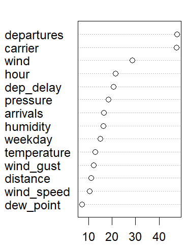

# JFK Data Analysis - Phase 4

## Analysis Overview

This document provides an overview of the fourth phase of analysis using the [JFK Airport dataset](https://www.kaggle.com/datasets/deepankurk/flight-take-off-data-jfk-airport/data). The main question guiding this work is: 

**What factors most strongly affect taxi‑out times, and how?**

This phase delivers predictive modeling using **LASSO**, **GAM**, and **Random Forests**, with cross‑validation and feature evaluation, all executed in **R** environment.

## Methodology Overview

 For efficiency and reproducibility, two functions were created: 
 * [**evaluation**](R_scripts/evaluation_function.R) which given the model and the test_data, it returns basic metrics
 * [**lasso**](R_scripts/lasso_function.R) which given x and y, it returns LASSO coefficient table and basic metrics.
 
 The main body of this Phase has three parts:
 
* **LASSO**: Each run is limited to one or two categorical factors to avoid overloading the model and to highlight where meaningful coefficient weight appears.

* **GAM**: Several Generalized Additive Models specifications are tested to capture the nonlinear structure of the problem and explore smooth relationships across key variables.

* **Random Forests**: Finally, Random Forests are applied to obtain the strongest predictive model, with tuning focused on nodes and mtry to capture complex interactions.

All models use the same **80/20** split and are evaluated with **RMSE**, **MAE**, and **R²**.

## Variable Selection
 The variables **id**, **flight_code**, **distance** and **destination** were removed because they effectively behave as identifiers.
While **flight_code** has **2.092** distinct values, and **destination** has **65**, the real dilemma was whether to include **destination**, but after private tests and stakeholder confirmation, it was excluded due to the high risk of overfitting and adding noise rather than meaningful signal.

The **timestamp** feature was transformed into **hour** and **weekday**, which were kept in the analysis. The original **timestamp** column was removed because its raw form is not directly useful.

## Top Model Result

The Random Forest model including all usable variables delivers the best results, based on the **average performance across 30 repeated train–test splits**, with:

* **MAE: 4.98**
* **RMSE: 6.27**
* **R²: 0.16**

The influence of **departures** and **wind** is confirmed in the variable importance plot shown below. While the **carrier** also ranks among the top three variables, its special identity should raise concerns for stakeholders about whether it should be included in the calculations. 

## Summary
 This phase approaches modeling with respect for how broad and technically deep the field is, focusing specifically on the areas where **Lasso**, **Generalized Additive Model**, and **Random Forests** apply. The full code is available in the [R_markdown](Phase_4.Rmd) file for reproducibility, and the separated components can be found in the [R_scripts](R_scripts) and [Visuals](Visuals) directories. 
With these foundations in place, stakeholders now have a clearer view of the main drivers of **taxi_out** time and a starting point for further development of operational improvements at **JFK**.
From an analytical perspective, **departures** appear to play a meaningful role in **taxi_out** effectiveness and represent a sensible direction for further investigation.
